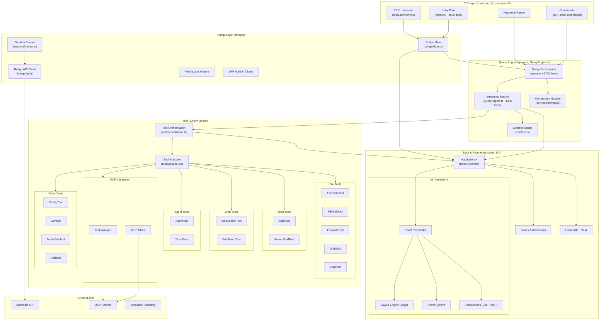
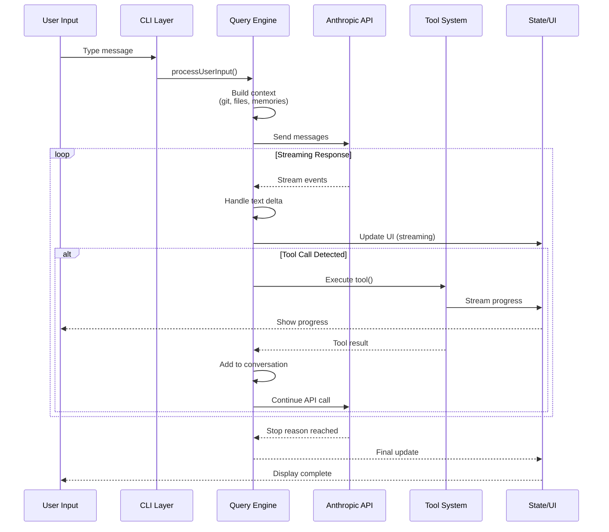
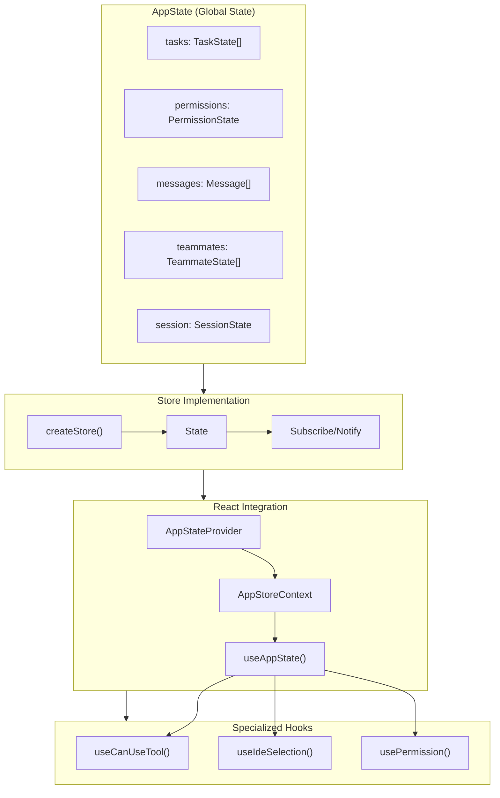
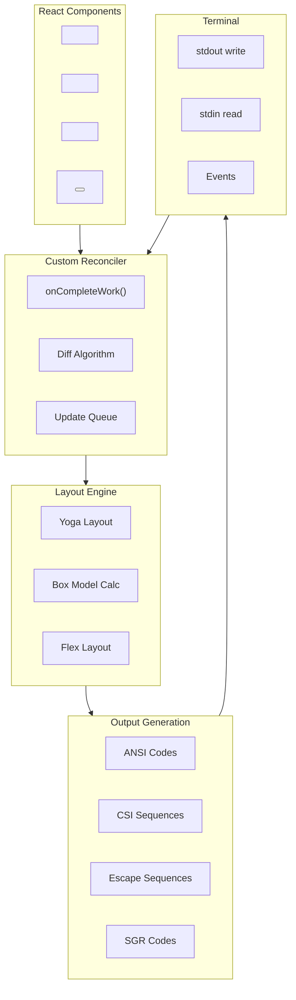
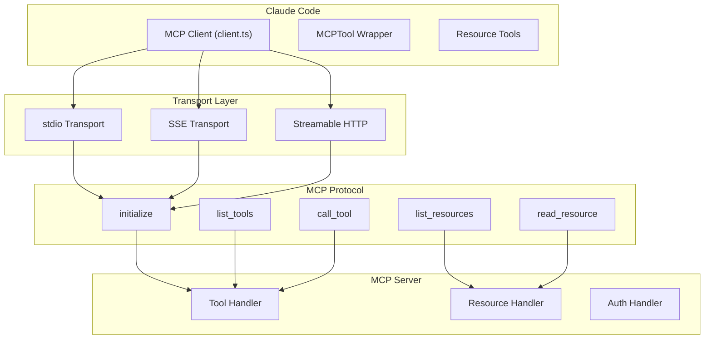
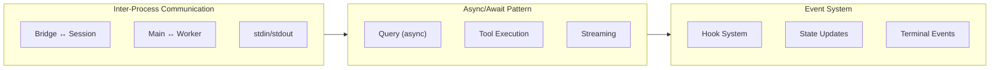
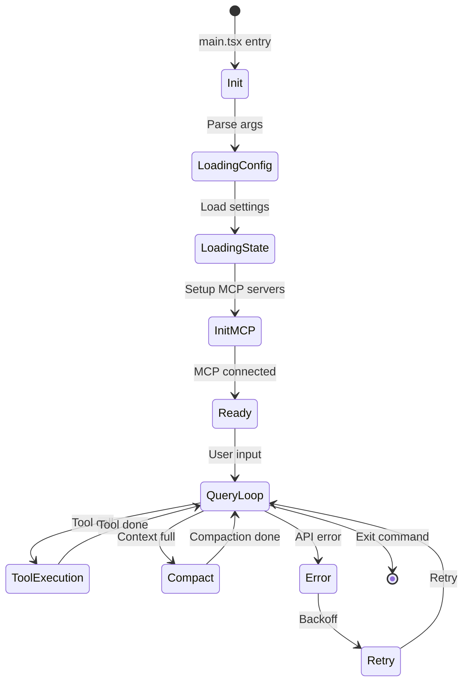

# Architecture Diagram

## High-Level System Architecture



## Query Loop Architecture



## Tool Execution Flow

```mermaid
flowchart LR
    subgraph Detection["1. Tool Detection"]
        D_STREAM["Streaming Response"]
        D_PARSE["Parse Tool Call"]
        D_BLOCK["ToolUseBlock"]
    end
    
    subgraph Permission["2. Permission Check"]
        P_CHECK["CanUseTool()"]
        P_STATE["Permission State"]
        P_ASK{"User Response?"}
        P_APPROVE[Approved]
        P_DENY[Denied]
    end
    
    subgraph Execution["3. Tool Execution"]
        E_FIND["findToolByName()"]
        E_PARTITION["Partition by Safety"]
        E_CONCURRENT["Read-only: Concurrent"]
        E_SERIAL["Stateful: Serial"]
        E_STREAM["Stream Progress"]
        E_RESULT["Tool Result"]
    end
    
    subgraph Result["4. Result Processing"]
        R_ADD["Add to Messages"]
        R_MAYBE_COMPACT["Check Compaction"]
        R_LOOP["Loop or Exit"]
    end
    
    D_STREAM --> D_PARSE --> D_BLOCK
    D_BLOCK --> P_CHECK --> P_STATE
    P_STATE --> P_ASK
    P_ASK -->|Yes| P_APPROVE
    P_ASK -->|No| P_DENY
    P_APPROVE --> E_FIND
    E_FIND --> E_PARTITION
    E_PARTITION --> E_CONCURRENT
    E_PARTITION --> E_SERIAL
    E_CONCURRENT --> E_STREAM
    E_SERIAL --> E_STREAM
    E_STREAM --> E_RESULT
    E_RESULT --> R_ADD
    R_ADD --> R_MAYBE_COMPACT
    R_MAYBE_COMPACT --> R_LOOP
```



## State Management Architecture



## Terminal Rendering (Ink System)



## MCP (Model Context Protocol) Integration



## File Structure Overview

```
claude-code-xray/
├── main.tsx                          # Main entry (~4600 lines)
├── query.ts                          # Query orchestration (~1700 lines)
├── QueryEngine.ts                    # Streaming engine (~1200 lines)
├── Tool.ts                           # Tool definitions (~700 lines)
├── tools.ts                          # Tool registry (~400 lines)
├── context.ts                        # Context gathering (~200 lines)
│
├── cli/                              # CLI arguments
├── commands/                         # 100+ slash commands
├── bridge/                           # Session management
│   ├── bridgeMain.ts                 # Bridge coordinator
│   ├── bridgeApi.ts                  # API client
│   ├── sessionRunner.ts              # Session spawning
│   └── types.ts                      # Shared types
│
├── services/                         # Business logic services
│   ├── api/                          # API calls
│   ├── compact/                      # Context compaction
│   ├── mcp/                         # MCP integration
│   └── tools/                       # Tool execution
│
├── tools/                            # Tool implementations
│   ├── BashTool/                     # Shell execution
│   ├── FileReadTool/                 # File reading
│   ├── FileEditTool/                 # File editing
│   ├── MCPTool/                      # MCP wrapper
│   └── AgentTool/                    # Sub-agents
│
├── state/                            # State management
│   ├── AppState.tsx                  # React context
│   └── store.ts                      # Store implementation
│
├── ink/                              # Terminal UI
│   ├── reconciler.ts                 # React reconciler
│   ├── layout/                       # Layout engine
│   └── components/                   # UI components
│
├── hooks/                            # React hooks (88+)
├── utils/                            # Utilities (332 files)
└── types/                            # TypeScript types
```

## Communication Patterns



## Session Lifecycle


