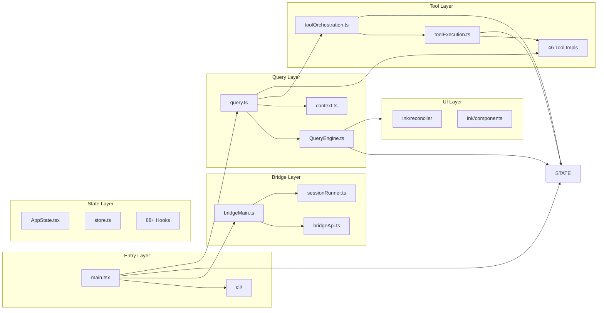
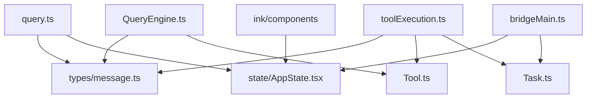
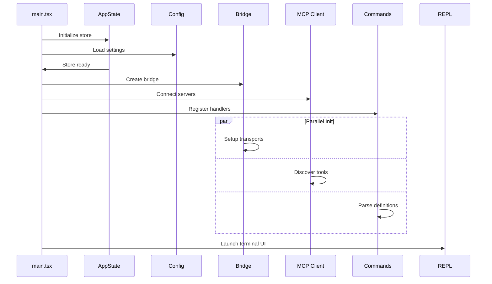

# Dependency Graph: How Components Connect

This document maps the complex interdependencies between Claude Code's modules, showing how data and control flow through the system.

## High-Level Dependency Map



## Detailed Dependency Chains

### Startup Chain

```
main.tsx
├── bootstrap/state.ts
│   └── → Used by: almost everything (global state)
├── utils/config.ts
│   └── → Used by: bridge/, query/, tools/
├── utils/auth.ts
│   └── → Used by: bridge/, services/api/, query/
├── services/mcp/client.ts
│   └── → Used by: tools/, bridge/
└── commands/*.ts
    └── → Used by: main.tsx, bridge/
```

### Query Chain

```
query.ts
├── QueryEngine.ts
│   ├── services/api/claude.ts
│   │   └── → External: Anthropic API
│   ├── services/tools/toolOrchestration.ts
│   │   ├── services/tools/toolExecution.ts
│   │   │   └── tools/*/index.ts
│   │   └── state/AppState.tsx
│   ├── utils/messages.ts
│   │   └── types/message.ts
│   └── context.ts
│       ├── utils/git.ts
│       └── utils/claudemd.ts
└── state/AppState.tsx
    └── hooks/useCanUseTool.ts
```

### Tool Execution Chain

```
toolOrchestration.ts (runTools)
├── toolExecution.ts (runToolUse)
│   ├── Tool.ts (findToolByName)
│   │   └── tools.ts (getTools)
│   │       └── tools/*/index.ts
│   ├── hooks/useCanUseTool.ts
│   │   └── state/AppState.tsx
│   └── tools/*/index.ts (specific tools)
│       ├── BashTool → child_process
│       ├── FileReadTool → fs
│       ├── WebSearchTool → fetch
│       └── MCPTool → MCP SDK
└── state/AppState.tsx
```

### Permission Chain

```
Permission Request
├── hooks/useCanUseTool.ts (canUseTool)
│   └── state/AppState.tsx (permission state)
├── tools/BashTool/bashSecurity.ts
│   └── Dangerous command detection
├── bridge/bridgePermissionCallbacks.ts
│   └── Cross-process permission relay
└── bridgeMain.ts (PermissionCoordinator)
    └── Remote bridge communication
```

### UI Update Chain

```
State Change
├── state/store.ts (setState)
│   └── Notifies all subscribers
├── React Context (AppStoreContext)
│   └── Triggers re-render
├── ink/reconciler.ts
│   └── Schedules render work
└── ink/components/*.tsx
    └── Re-render specific components
```

## Import Patterns

### Pattern 1: Lazy Require (Circular Dependency Breaking)

```typescript
// Used when two modules depend on each other
// File A: hooks/useCanUseTool.ts
import { getTools } from '../tools.js'

// File B: tools.ts
// Can't directly import from hooks/useCanUseTool.ts
// Solution: Lazy require inside function

export function getAllowedTools() {
  // Lazy import to avoid circular dependency
  const { useCanUseTool } = require('../hooks/useCanUseTool.js')
  // ...
}
```

### Pattern 2: Feature Flagged Imports (Dead Code Elimination)

```typescript
// Only include in specific builds
const SleepTool = feature('PROACTIVE') || feature('KAIROS')
  ? require('./tools/SleepTool/SleepTool.js').SleepTool
  : null

const cronTools = feature('AGENT_TRIGGERS')
  ? [
      require('./tools/ScheduleCronTool/CronCreateTool.js').CronCreateTool,
      // ...
    ]
  : []
```

### Pattern 3: Cross-Module State Access

```typescript
// State is accessed via React Context
// But also via direct store access for non-React code

// In React component
const { messages } = useAppState()

// In tool/async function
const { getAppState } = useToolContext()
const state = getAppState()
```

### Pattern 4: Service Singleton

```typescript
// Services are often singletons initialized at startup
// services/mcp/client.ts

let globalClient: MCPClient | null = null

export function getMCPClient(): MCPClient {
  if (!globalClient) {
    globalClient = new MCPClient()
  }
  return globalClient
}
```

## Shared Type Dependencies



## Key Shared Utilities

### Message Utilities (utils/messages.ts)

Used by: `query.ts`, `QueryEngine.ts`, `toolExecution.ts`, `tools/*/`

```typescript
// Central message creation and manipulation
export function createUserMessage(content: string): UserMessage
export function createAssistantMessage(content: string): AssistantMessage
export function createToolResultMessage(result: ToolResult): ToolResultMessage
export function createProgressMessage(progress: Progress): ProgressMessage
export function normalizeMessagesForAPI(messages: Message[]): NormalizedMessage[]
export function countToolCalls(messages: Message[]): number
```

### Error Utilities (utils/errors.ts)

Used by: All layers

```typescript
// Centralized error handling
export class APIError extends Error
export class ToolExecutionError extends Error
export class PermissionDeniedError extends Error
export class AbortError extends Error
export function errorMessage(error: unknown): string
```

### Async Utilities (utils/sleep.ts, utils/abortController.ts)

Used by: All layers

```typescript
// Async helpers
export function sleep(ms: number): Promise<void>
export function timeout<T>(promise: Promise<T>, ms: number): Promise<T>
export function createAbortController(): AbortController
export function raceWithAbort<T>(promise: Promise<T>, signal: AbortSignal): Promise<T>
```

## Dependency Inversion Examples

### Interface-Based Tool System

```typescript
// Tool.ts defines the interface
export interface Tool {
  name: string
  execute(input: unknown, context: ToolUseContext): Promise<ToolResult>
}

// tools.ts implements the interface
const TOOLS: Tool[] = [
  new BashTool(),
  new FileReadTool(),
  // ...
]

// Query engine uses the interface, not implementations
async function executeTool(tool: Tool, input: unknown) {
  return tool.execute(input, context)  // Works with any Tool
}
```

### Context Objects (Dependency Injection)

```typescript
// ToolUseContext is injected, not imported
export interface ToolUseContext {
  canUseTool: CanUseToolFn
  getAppState: () => AppState
  setAppState: SetAppState
  abortController: AbortController
}

// Passed to tools at execution time
tool.execute(input, context)  // context is provided by orchestrator
```

## Circular Dependency Management

Claude Code carefully manages circular dependencies through:

1. **Lazy Requires**: `require()` inside functions, not at module level
2. **Interface Extraction**: Shared types in `types/` folder
3. **Context Passing**: Dependencies passed via function parameters
4. **Event-Based Decoupling**: Components communicate via events, not direct calls

### Example: Lazy Require

```typescript
// bridgeMain.ts needs to call query.ts
// query.ts imports from state/AppState.tsx
// AppState.tsx might indirectly import from bridgeMain.ts

// Solution: Lazy require in bridgeMain.ts
async function runQuery(params: QueryParams) {
  // Only import when needed
  const { query } = await import('./query.js')
  return query(params)
}
```

## Startup Dependency Order



## Memory/Cache Dependencies

```typescript
// Memoization is used heavily to avoid recomputation

// context.ts - Git status is memoized
export const getGitStatus = memoize(async (): Promise<string | null> => {
  // Expensive git operations
  return gitStatus
})

// utils/model/model.ts - Model resolution is cached
export const getAvailableModels = memoize(async (): Promise<Model[]> => {
  // API call to get available models
  return models
})

// utils/claudemd.ts - Memory file reading is cached
export const getMemoryFiles = memoize(async (): Promise<MemoryFile[]> => {
  // File system reads
  return memoryFiles
})
```

## Summary

The dependency structure follows these principles:

1. **State at the center** — `AppState.tsx` is the hub
2. **Query orchestrates** — `query.ts` coordinates most operations
3. **Tools are leaf nodes** — Tools depend on state, not vice versa
4. **UI is a leaf** — UI reads state, doesn't write directly
5. **Services are singletons** — Initialized once, shared everywhere
6. **Circular deps broken** — Via lazy requires and interfaces
