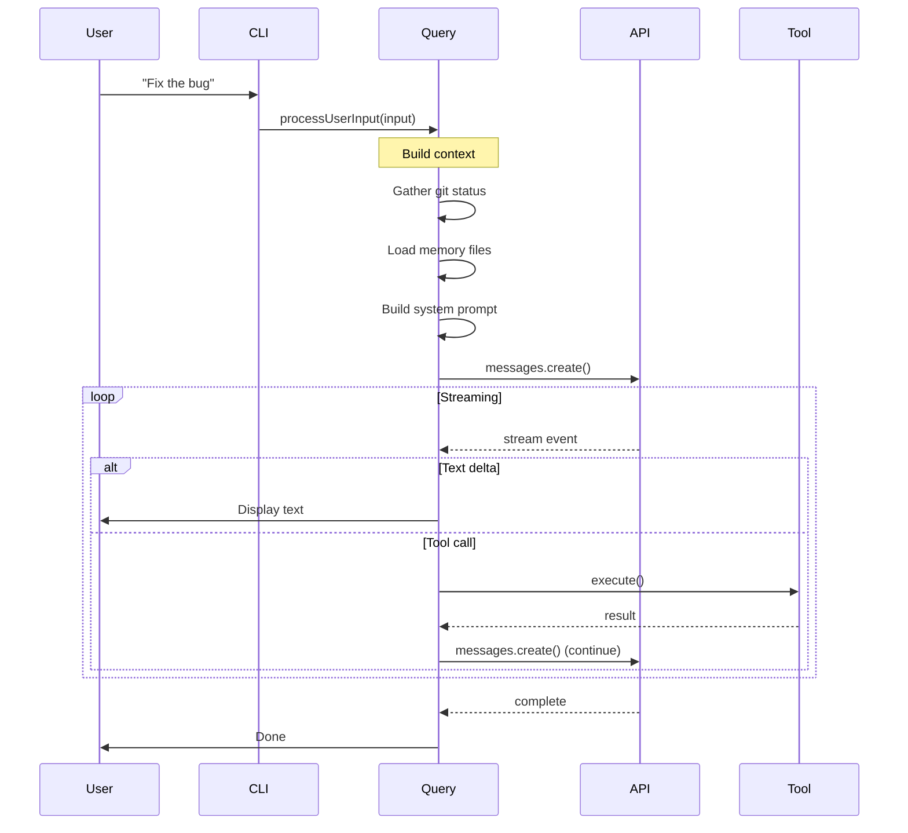

# Modules Breakdown: Deep Dive into Claude Code's Architecture

This document provides a comprehensive breakdown of each major module in Claude Code, explaining what it does, how it interacts with others, and the key design decisions behind it.

## Module Map

```
claude-code-xray/
├── 01_entry_point/          # How the app starts
│   ├── main.tsx             # Entry point (4600+ lines)
│   ├── cli/                  # CLI argument parsing
│   └── replLauncher.tsx     # REPL initialization
│
├── 02_bridge/               # Session & permission management
│   ├── bridgeMain.ts         # Bridge coordinator
│   ├── sessionRunner.ts      # Session lifecycle
│   ├── bridgeApi.ts          # Remote communication
│   └── permissions/          # Permission state machine
│
├── 03_query/                 # AI interaction core
│   ├── query.ts              # Query orchestration
│   ├── QueryEngine.ts         # Streaming implementation
│   └── context.ts             # System context
│
├── 04_tools/                 # Tool system
│   ├── toolOrchestration.ts   # Tool execution pipeline
│   ├── toolExecution.ts       # Individual tool execution
│   └── tools/                 # 46+ tool implementations
│
├── 05_state/                 # State management
│   ├── AppState.tsx           # Global state (React)
│   ├── store.ts               # Simple reactive store
│   └── hooks/                 # React hooks (88+)
│
├── 06_terminal/              # UI rendering
│   ├── ink/                   # React-to-terminal renderer
│   └── components/           # UI components
│
└── 07_services/              # Supporting services
    ├── compact/              # Context compaction
    ├── mcp/                 # Model Context Protocol
    └── api/                 # API communication
```

## Module 1: Entry Point (main.tsx)

**File**: `main.tsx` (~4600 lines)

### What It Does

This is the bootstrap code — the first thing that runs when Claude Code starts. It orchestrates the entire application initialization sequence.

### Initialization Sequence

```typescript
// Step 1: Profile checkpoint (before heavy imports)
profileCheckpoint('main_tsx_entry')

// Step 2: Start MDM reads (macOS device management)
startMdmRawRead()

// Step 3: Prefetch keychain data
startKeychainPrefetch()

// Step 4: Import all modules (~135ms)
import { /* 50+ modules */ } from './...'

// Step 5: Setup command-line interface
const program = new Command()

// Step 6: Register all commands
program
  .command('claude')
  .action(() => launchRepl())

// Step 7: Run startup sequence
await runStartupSequence()
```

### Key Responsibilities

1. **Startup Profiling**: Measures time spent in each initialization phase
2. **Configuration Loading**: Loads settings from config files and environment
3. **Auth Initialization**: Sets up OAuth, API keys, session tokens
4. **Telemetry Setup**: Initializes analytics and error reporting
5. **MCP Server Bootstrap**: Loads and starts MCP servers
6. **Command Registration**: Registers all slash commands
7. **REPL Launch**: Starts the interactive terminal interface

### Interesting Design Decisions

**Dead Code Elimination via Feature Flags**:
```typescript
// Only include SleepTool in specific builds
const SleepTool = feature('PROACTIVE') || feature('KAIROS')
  ? require('./tools/SleepTool/SleepTool.js').SleepTool
  : null

// Coordinator mode (internal feature)
const coordinatorModeModule = feature('COORDINATOR_MODE')
  ? require('./coordinator/coordinatorMode.js')
  : null
```

This allows Claude Code to ship different builds with different features while keeping the binary size minimal.

**Lazy Module Loading**:
```typescript
// Modules are lazy-loaded to avoid circular dependencies
const getTeammateUtils = () =>
  require('./utils/teammate.js')

const getTeammatePromptAddendum = () =>
  require('./utils/swarm/teammatePromptAddendum.js')
```

### Interactions
- **→ bridge/**: Creates bridge connections for remote sessions
- **→ state/**: Initializes global application state
- **→ cli/**: Parses command-line arguments
- **← ink/**: Receives rendered UI output

---

## Module 2: Bridge Layer (bridge/)

**Key Files**:
- `bridgeMain.ts` (~3000 lines)
- `bridgeApi.ts`
- `sessionRunner.ts`
- `bridgeMessaging.ts`

### What It Does

The Bridge layer manages **cross-process communication** and **session lifecycle**. It enables Claude Code to:
- Run AI processing on remote machines
- Manage multiple concurrent sessions
- Handle permission escalations across process boundaries
- Coordinate team-based workflows

### Architecture Overview

```
┌─────────────────────────────────────────────────────────────┐
│                      LOCAL PROCESS                          │
│  ┌──────────────┐    ┌──────────────┐    ┌──────────────┐ │
│  │  CLI/User    │    │   Bridge     │    │   Bridge     │ │
│  │  Interface   │───▶│   Main       │◀───│   API Client │ │
│  └──────────────┘    └──────┬───────┘    └──────────────┘ │
│                              │                               │
│  ┌──────────────┐    ┌──────▼───────┐                      │
│  │  Session     │◀───│   Session    │                      │
│  │  (Local/     │    │   Runner      │                      │
│  │   Remote)    │    └──────────────┘                      │
│  └──────────────┘                                           │
└──────────────────────────────┬──────────────────────────────┘
                               │ WebSocket/HTTP
┌──────────────────────────────▼──────────────────────────────┐
│                     REMOTE PROCESS                           │
│  ┌──────────────┐    ┌──────────────┐    ┌──────────────┐ │
│  │   Remote     │───▶│   Remote     │◀───│   Claude     │ │
│  │   Bridge     │    │   Bridge     │    │   API        │ │
│  └──────────────┘    └──────────────┘    └──────────────┘ │
└─────────────────────────────────────────────────────────────┘
```

### Session Runner

The `sessionRunner.ts` is responsible for **spawning and managing Claude Code sessions**:

```typescript
export interface SessionSpawnOpts {
  cwd: string
  sessionId: string
  model?: string
  spawnMode: 'local' | 'remote' | 'attached'
  onExit?: (code: number) => void
  onMessage?: (msg: BridgeMessage) => void
}

export function createSessionSpawner(
  config: BridgeConfig
): SessionSpawner {
  return {
    async spawn(opts: SessionSpawnOpts): Promise<SessionHandle> {
      // Spawn new process or connect to remote
      const handle = opts.spawnMode === 'local'
        ? spawnLocalSession(opts)
        : connectToRemote(opts)
      return handle
    }
  }
}
```

### Permission Escalation

When a tool requires permission, the bridge coordinates with the user:

```
1. Tool calls requirePermission()
2. Bridge sends permission request to local process
3. Local UI prompts user
4. User approves/denies
5. Bridge relays response to session
6. Tool continues or throws error
```

### Backoff Strategy

Network operations use exponential backoff:

```typescript
const DEFAULT_BACKOFF: BackoffConfig = {
  connInitialMs: 2_000,      // Start with 2 second delay
  connCapMs: 120_000,        // Cap at 2 minutes
  connGiveUpMs: 600_000,     // Give up after 10 minutes
  generalInitialMs: 500,      // General ops start at 500ms
  generalCapMs: 30_000,      // Cap at 30 seconds
}
```

### Interactions
- **↔ Query Engine**: Receives tool execution requests
- **↔ UI**: Sends permission prompts and status updates
- **↔ Remote Bridge**: Communicates via WebSocket/HTTP
- **→ API**: Makes calls to Anthropic API

---

## Module 3: Query Engine (query.ts, QueryEngine.ts)

**Key Files**:
- `query.ts` (~1700 lines)
- `QueryEngine.ts` (~1200 lines)
- `context.ts` (~200 lines)

### What It Does

The Query Engine is the **brain** of Claude Code. It orchestrates the entire AI interaction loop, from receiving user input to handling tool results.

### The Query Flow



### Query Orchestration (query.ts)

The `query.ts` file handles the high-level orchestration:

```typescript
export async function query(
  params: QueryParams
): Promise<QueryResult> {
  // 1. Validate and normalize input
  const normalized = normalizeInput(params.input)
  
  // 2. Build conversation context
  const context = await buildContext(params)
  
  // 3. Add memory files if present
  const withMemory = await addMemoryFiles(context)
  
  // 4. Create streaming query engine
  const engine = new QueryEngine({
    messages: withMemory,
    model: params.model,
    tools: params.tools,
  })
  
  // 5. Execute with tool handling
  for await (const event of engine.stream()) {
    if (event.type === 'text') {
      yield event.text
    } else if (event.type === 'tool_use') {
      yield* executeTool(event.tool)
    } else if (event.type === 'error') {
      handleError(event.error)
    }
  }
}
```

### Streaming Implementation (QueryEngine.ts)

The `QueryEngine.ts` handles the low-level streaming:

```typescript
export class QueryEngine {
  private client: Anthropic
  private messages: Message[]
  
  async *stream(): AsyncGenerator<StreamEvent> {
    const stream = await this.client.messages.stream({
      model: this.model,
      max_tokens: this.maxTokens,
      messages: this.messages,
      tools: this.tools,
    })
    
    for await (const event of stream) {
      yield this.processEvent(event)
    }
  }
  
  private processEvent(event: RawStreamEvent): StreamEvent {
    switch (event.type) {
      case 'content_block_delta':
        if (event.delta.type === 'text_delta') {
          return { type: 'text', text: event.delta.text }
        } else if (event.delta.type === 'tool_use_delta') {
          return { type: 'tool_use_start', tool: event.delta }
        }
      case 'message_delta':
        return { type: 'complete', usage: event.usage }
      // ... other event types
    }
  }
}
```

### Context Building (context.ts)

The `context.ts` file gathers system context for each query:

```typescript
export async function getSystemContext(): Promise<string> {
  const [gitStatus, branch, projectInfo] = await Promise.all([
    getGitStatus(),
    getBranch(),
    getProjectInfo(),
  ])
  
  return [
    '# Git Status',
    gitStatus,
    '',
    '# Current Branch',
    branch,
    '',
    '# Project Info',
    projectInfo,
  ].join('\n')
}
```

Key context gathered:
- **Git status**: `git status --short`, recent commits, current branch
- **User info**: Git username
- **Project structure**: Language, framework detection
- **Memory files**: `.claude/memory.md` and related files

### Interactions
- **← CLI**: Receives processed user input
- **→ API**: Sends messages, receives streaming responses
- **→ Tools**: Dispatches tool execution requests
- **← Tools**: Receives tool results
- **→ State**: Updates application state
- **→ UI**: Streams text output for display

---

## Module 4: Tool System (tools/)

**Key Files**:
- `tools.ts` (~400 lines) — Tool registry
- `Tool.ts` (~700 lines) — Tool definitions
- `services/tools/toolOrchestration.ts` — Execution pipeline
- `services/tools/toolExecution.ts` (~1700 lines) — Execution logic

### What It Does

The Tool System is the **hands** of Claude Code. It translates AI tool calls into real operations on the filesystem, shell, web, and more.

### Tool Architecture

```
┌─────────────────────────────────────────────────────────────┐
│                      TOOL LAYER                            │
│  ┌─────────────────────────────────────────────────────┐   │
│  │                  Tool Registry                       │   │
│  │  getTools() → Tool[]                               │   │
│  │  findToolByName(name) → Tool | undefined          │   │
│  │  toolMatchesName(tool, name) → boolean             │   │
│  └─────────────────────────────────────────────────────┘   │
│                            │                               │
│  ┌─────────────────────────▼──────────────────────────┐   │
│  │              Tool Orchestration                     │   │
│  │  runTools() — AsyncGenerator                       │   │
│  │  - Partitions by concurrency safety                │   │
│  │  - Runs read-only tools concurrently               │   │
│  │  - Runs stateful tools serially                    │   │
│  └─────────────────────────────────────────────────────┘   │
│                            │                               │
│  ┌─────────────────────────▼──────────────────────────┐   │
│  │              Tool Execution                          │   │
│  │  runToolUse() — Generator                           │   │
│  │  - Finds tool implementation                        │   │
│  │  - Checks permissions                               │   │
│  │  - Executes with progress streaming                │   │
│  └─────────────────────────────────────────────────────┘   │
│                            │                               │
│  ┌─────────────────────────▼──────────────────────────┐   │
│  │           Tool Implementations (46+ tools)         │   │
│  │  BashTool, FileReadTool, WebSearchTool, etc.      │   │
│  └─────────────────────────────────────────────────────┘   │
└─────────────────────────────────────────────────────────────┘
```

### Tool Definition (Tool.ts)

Every tool follows a standard interface:

```typescript
export interface Tool {
  name: string
  description: string
  inputSchema: ToolInputJSONSchema
  
  // Permission requirements
  permission?: ToolPermission
  
  // Progress type for streaming
  progress?: ToolProgressType
  
  // Execute the tool
  execute(input: unknown, context: ToolUseContext): Promise<ToolResult>
}
```

### Tool Orchestration (toolOrchestration.ts)

The orchestration layer decides **how** to run tools:

```typescript
export async function* runTools(
  toolUseMessages: ToolUseBlock[],
  assistantMessages: AssistantMessage[],
  canUseTool: CanUseToolFn,
  toolUseContext: ToolUseContext,
): AsyncGenerator<MessageUpdate, void> {
  // Partition tools by concurrency safety
  const { safeBlocks, unsafeBlocks } = partitionToolCalls(
    toolUseMessages,
    toolUseContext
  )
  
  // Read-only tools can run concurrently
  if (safeBlocks.length > 0) {
    yield* runToolsConcurrently(safeBlocks, ...)
  }
  
  // State-changing tools must run serially
  if (unsafeBlocks.length > 0) {
    yield* runToolsSerially(unsafeBlocks, ...)
  }
}

function partitionToolCalls(
  toolUses: ToolUseBlock[],
  context: ToolUseContext
): { safeBlocks: ToolUseBlock[], unsafeBlocks: ToolUseBlock[] } {
  return {
    safeBlocks: toolUses.filter(isReadOnlyTool),
    unsafeBlocks: toolUses.filter(t => !isReadOnlyTool(t)),
  }
}
```

### Tool Execution (toolExecution.ts)

Each tool execution goes through this pipeline:

```typescript
export async function* runToolUse(
  toolUse: ToolUseBlock,
  context: ToolUseContext,
): AsyncGenerator<MessageUpdate, void> {
  // 1. Find the tool implementation
  const tool = findToolByName(toolUse.name)
  if (!tool) {
    yield createErrorMessage(`Tool not found: ${toolUse.name}`)
    return
  }
  
  // 2. Check permissions
  const canUse = await context.canUseTool(tool.name)
  if (!canUse) {
    yield* requestPermission(tool)
    return
  }
  
  // 3. Execute the tool
  try {
    const result = await tool.execute(toolUse.input, context)
    yield { message: createSuccessMessage(result) }
  } catch (error) {
    yield { message: createErrorMessage(error) }
  }
}
```

### Key Tool Implementations

#### BashTool (~44 files)

The most complex tool, handling shell command execution:

```
tools/BashTool/
├── BashTool.ts          # Main implementation
├── toolName.ts          # Tool name constant
├── prompt.ts            # System prompt instructions
├── bashSecurity.ts      # Security checks
├── commandSemantics.ts  # Command parsing
├── modeValidation.ts    # Permission mode checks
├── bashCommandHelpers.ts # Helper functions
└── UI.tsx               # Progress display
```

Key security features:
- Destructive command detection (rm -rf, :(){:|:&}, etc.)
- Path traversal prevention
- Timeout enforcement
- Working directory validation

#### FileEditTool

The primary file editing tool using structured diffs:

```typescript
export class FileEditTool {
  async execute(input: FileEditInput, context: ToolUseContext) {
    // 1. Read the file
    const content = await readFile(input.file_path)
    
    // 2. Parse the edit instructions
    const edits = parseEdits(input.edits)
    
    // 3. Apply edits
    const newContent = applyEdits(content, edits)
    
    // 4. Write back
    await writeFile(input.file_path, newContent)
    
    return { success: true, new_content: newContent }
  }
}
```

#### MCPTool

Dynamic tool wrapper for Model Context Protocol servers:

```typescript
export class MCPTool {
  async execute(input: MCPtoolInput, context: ToolUseContext) {
    // 1. Get MCP client for this server
    const client = await getMCPClient(input.server_name)
    
    // 2. Call the MCP tool
    const result = await client.callTool(input.tool_name, input.arguments)
    
    // 3. Format result for Claude
    return formatMCPResult(result)
  }
}
```

### Interactions
- **← Query Engine**: Receives tool call requests
- **→ State**: Checks and updates permission state
- **→ File System**: Reads/writes files
- **→ Shell**: Executes commands
- **→ Web**: Fetches/searches web
- **→ MCP Servers**: Calls external tools
- **→ UI**: Streams progress updates

---

## Module 5: State Management (state/, AppState.tsx)

**Key Files**:
- `state/AppState.tsx` (~200 lines)
- `state/store.ts` (~35 lines)
- `state/AppStateStore.ts`

### What It Does

The State layer provides **reactive global state** that any part of the application can access and modify.

### Store Implementation (store.ts)

A minimal reactive store inspired by Zustand:

```typescript
type Listener = () => void

export type Store<T> = {
  getState: () => T
  setState: (updater: (prev: T) => T) => void
  subscribe: (listener: Listener) => () => void
}

export function createStore<T>(
  initialState: T,
  onChange?: OnChange<T>,
): Store<T> {
  let state = initialState
  const listeners = new Set<Listener>()

  return {
    getState: () => state,
    
    setState: (updater) => {
      const prev = state
      const next = updater(prev)
      if (Object.is(next, prev)) return  // Skip if no change
      state = next
      onChange?.({ newState: next, oldState: prev })
      listeners.forEach(l => l())        // Notify all listeners
    },
    
    subscribe: (listener) => {
      listeners.add(listener)
      return () => listeners.delete(listener)
    },
  }
}
```

**Key Insight**: This is only ~35 lines but provides all the reactivity Claude Code needs. No external dependencies.

### AppState (AppState.tsx)

The global application state includes:

```typescript
export interface AppState {
  // Tasks
  tasks: TaskState[]
  
  // Conversation
  messages: Message[]
  
  // Permissions
  permissions: PermissionState
  deniedPermissions: DeniedPermission[]
  
  // Teammates (multi-agent)
  teammates: TeammateState[]
  
  // Session
  sessionId: string
  sessionStatus: 'active' | 'paused' | 'ended'
  
  // Settings
  settings: SettingsState
  
  // UI State
  isLoading: boolean
  errorMessage: string | null
}
```

### React Integration (AppState.tsx)

```typescript
export const AppStoreContext = React.createContext<AppStateStore | null>(null)

export function AppStateProvider({ children, initialState }) {
  const [store] = useState(() => createStore(initialState))
  
  // Wrap store with React context
  return (
    <AppStoreContext.Provider value={store}>
      {children}
    </AppStoreContext.Provider>
  )
}

// Custom hook to use the store
export function useAppState(): AppState {
  const store = useContext(AppStoreContext)
  const [state, setState] = useState(store!.getState)
  
  useEffect(() => {
    return store!.subscribe(() => setState(store!.getState()))
  }, [store])
  
  return state
}
```

### Permission State Machine

```typescript
export type PermissionState =
  | { status: 'unconfirmed'; toolName: string }
  | { status: 'requesting'; toolName: string }
  | { status: 'approved'; toolName: string }
  | { status: 'denied'; toolName: string; reason?: string }

// Transitions
function transition(
  current: PermissionState,
  event: PermissionEvent
): PermissionState {
  switch (current.status) {
    case 'unconfirmed':
      if (event.type === 'request') {
        return { status: 'requesting', toolName: current.toolName }
      }
    case 'requesting':
      if (event.type === 'approve') {
        return { status: 'approved', toolName: current.toolName }
      }
      if (event.type === 'deny') {
        return { status: 'denied', toolName: current.toolName, reason: event.reason }
      }
    // ...
  }
}
```

### Interactions
- **↔ All Layers**: Any module can read/write state
- **→ UI**: React components re-render on state changes
- **← Tools**: Tools can update state (e.g., add a task)
- **← Bridge**: Bridge updates session state
- **← Query Engine**: Query updates message state

---

## Module 6: Terminal UI (ink/)

**Key Files**:
- `ink/reconciler.ts` — Custom React reconciler
- `ink/layout/` — Layout engine
- `ink/components/` — UI components
- `ink/events/` — Event handling

### What It Does

The Ink system is a **React renderer that outputs ANSI terminal codes** instead of HTML. It allows Claude Code to build complex, reactive terminal UIs using familiar React patterns.

### Architecture

```
React Components (JSX)
        │
        ▼
Custom Reconciler
        │
        ▼
Layout Engine (Yoga)
        │
        ▼
ANSI Output Generator
        │
        ▼
Terminal (stdout)
```

### How It Works

```typescript
// Instead of HTML DOM, we render to terminal
import { render } from 'ink'

const App = () => (
  <Box flexDirection="column">
    <Box>Welcome to Claude Code</Box>
    <Spinner>Loading...</Spinner>
    <Box>Type your message below:</Box>
    <TextInput
      onSubmit={(value) => handleSubmit(value)}
      placeholder="> "
    />
  </Box>
)

render(<App />)
// Outputs ANSI escape codes to stdout
```

### Layout Engine (ink/layout/)

Uses Facebook's Yoga layout engine for flexbox-style layouts:

```typescript
import Yoga from 'yoga-wasm'

const node = Yoga.Node.create()
node.setDisplay(Yoga.DisplayFlex)
node.setFlexDirection(Yoga.FlexDirectionColumn)
node.setWidth(80)
node.setHeight(Yoga.Value.auto())

// Add children
const child = Yoga.Node.create()
child.setWidth(80)
child.setHeight(1)
node.insertChild(child, 0)

// Calculate layout
node.calculateLayout()

// Get results
const width = node.getLayout().width
const height = node.getLayout().height
```

### Event Handling (ink/events/)

Terminal events are translated to React events:

```typescript
// Keyboard input
stdin.on('data', (key) => {
  const event = parseKeypress(key)
  reconciler.dispatchEvent('keydown', event)
})

// Mouse input
stdin.on('data', (data) => {
  if (isMouseEvent(data)) {
    const event = parseMouseEvent(data)
    reconciler.dispatchEvent(event.type, event)
  }
})
```

### Key Components

| Component | Purpose |
|-----------|---------|
| `<Box>` | Container with flex layout |
| `<Text>` | Styled text output |
| `<Newline>` | Line break |
| `<Spacer>` | Flexible space |
| `<RawAnsi>` | Raw ANSI escape codes |
| `<ScrollBox>` | Scrollable container |
| `<Button>` | Interactive button |
| `<Link>` | Clickable link |

### Interactions
- **← All Layers**: State changes trigger re-renders
- **→ Terminal**: Writes ANSI escape codes
- **← Terminal**: Reads keyboard/mouse input
- **↔ State**: Connected via React context

---

## Module 7: Services

### Context Compaction (services/compact/)

When the conversation gets too long, Claude Code **summarizes** older messages:

```typescript
// compact.ts - Main compaction logic
export async function compactMessages(
  messages: Message[],
  maxTokens: number
): Promise<Message[]> {
  // 1. Find the compact boundary
  const boundary = findCompactBoundary(messages)
  
  // 2. Extract messages before boundary
  const olderMessages = messages.slice(0, boundary)
  const recentMessages = messages.slice(boundary)
  
  // 3. Ask Claude to summarize older messages
  const summary = await summarize(olderMessages)
  
  // 4. Create compact boundary message
  const compactMsg = createCompactBoundaryMessage(summary)
  
  // 5. Return truncated + summary
  return [compactMsg, ...recentMessages]
}
```

### MCP Client (services/mcp/)

Manages Model Context Protocol server connections:

```typescript
// client.ts - MCP client implementation
export class MCPClient {
  private connections: Map<string, MCPServerConnection>
  
  async connect(config: McpServerConfig): Promise<void> {
    const transport = this.createTransport(config)
    const client = new Client({ transport })
    await client.initialize()
    
    this.connections.set(config.name, {
      client,
      transport,
    })
  }
  
  async listTools(): Promise<McpTool[]> {
    const tools: McpTool[] = []
    for (const conn of this.connections.values()) {
      const result = await conn.client.listTools()
      tools.push(...result.tools)
    }
    return tools
  }
}
```

### API Layer (services/api/)

Handles all communication with Anthropic API:

```typescript
// claude.ts - API client
export class ClaudeAPI {
  private client: Anthropic
  
  async createMessage(params: MessageParams): Promise<Message> {
    return this.client.messages.create({
      model: params.model,
      max_tokens: params.maxTokens,
      messages: params.messages,
      tools: params.tools,
      stream: false,
    })
  }
  
  async streamMessage(params: MessageParams): Promise<Stream> {
    return this.client.messages.stream({
      model: params.model,
      max_tokens: params.maxTokens,
      messages: params.messages,
      tools: params.tools,
      stream: true,
    })
  }
}
```

---

## Dependency Graph

```
main.tsx
├── cli/args.ts
├── commands/*.ts
├── bridge/bridgeMain.ts
│   ├── bridge/bridgeApi.ts
│   ├── bridge/sessionRunner.ts
│   └── bridge/types.ts
├── state/AppState.tsx
│   ├── state/store.ts
│   └── hooks/*.ts
├── query.ts
│   ├── QueryEngine.ts
│   ├── context.ts
│   └── services/compact/*.ts
├── tools.ts
│   ├── tools/*/index.ts
│   └── services/tools/toolExecution.ts
│       ├── toolOrchestration.ts
│       └── tools/*/*.ts
└── ink/*.tsx
    ├── components/*.tsx
    └── hooks/*.ts
```

---

## Summary

Each module in Claude Code has a clear responsibility:

| Module | Responsibility | Key Pattern |
|--------|----------------|-------------|
| Entry Point | Bootstrap, config, startup | Feature flags, lazy loading |
| Bridge | Cross-process communication | WebSocket, backoff retry |
| Query Engine | AI orchestration | Streaming, async generators |
| Tool System | Execute operations | Pipeline, concurrency partitioning |
| State | Global state | Simple store, React context |
| Terminal UI | Render to terminal | Custom React reconciler |
| Services | Supporting features | Modular, focused |

The architecture demonstrates several best practices:
- **Clear separation of concerns** — Each layer has one job
- **Dependency injection** — Components receive dependencies via context
- **Streaming throughout** — Everything streams for responsiveness
- **Feature flags** — Dead code elimination keeps binaries small
- **Async/await** — Modern concurrency patterns throughout
