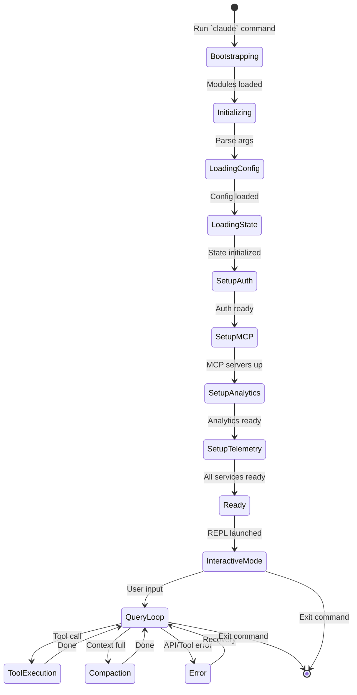
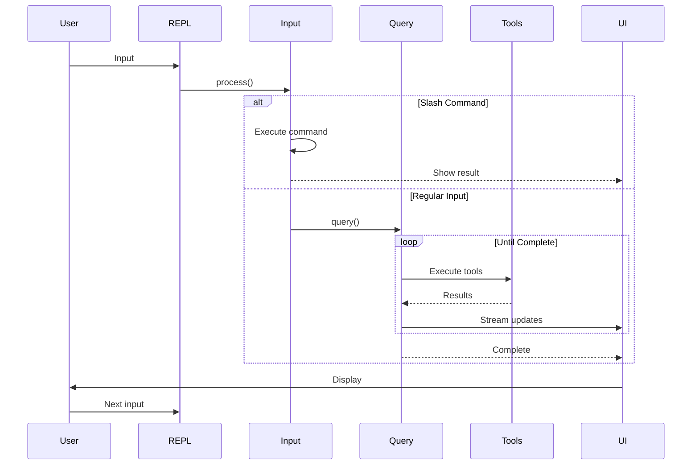
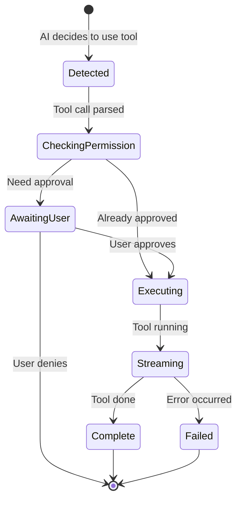
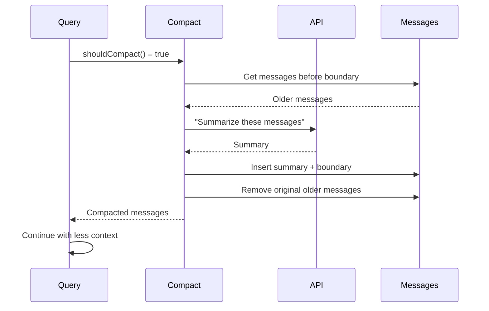
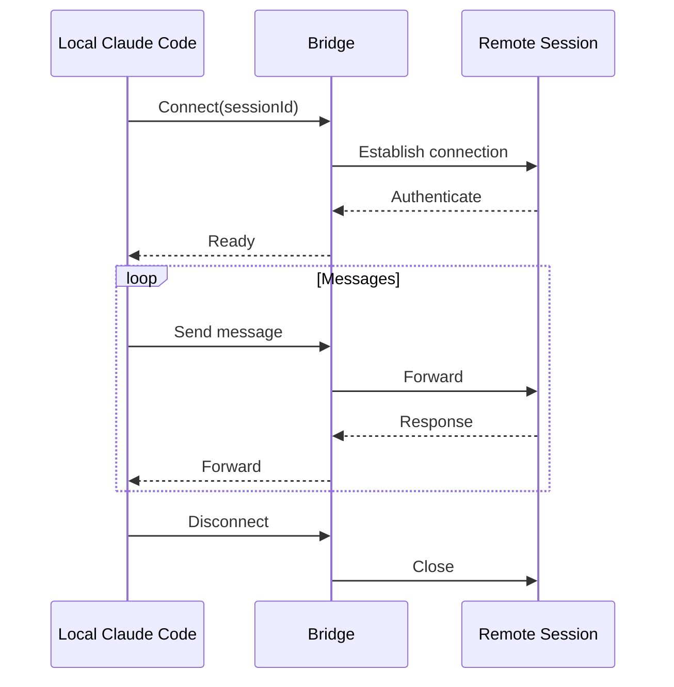
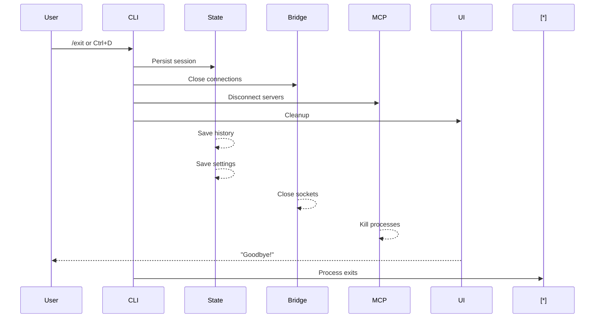
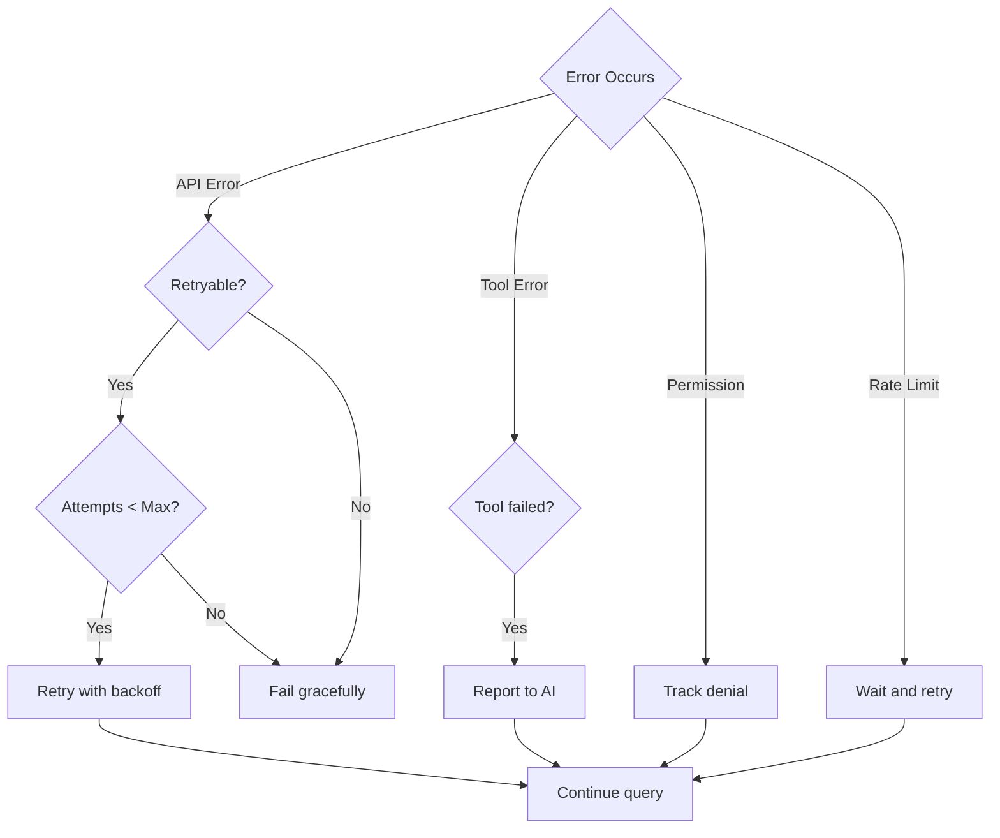

# Application Lifecycle: From Startup to Shutdown

This document describes the complete lifecycle of Claude Code, from when you first run it to when it exits.

## Lifecycle Overview



## Phase 1: Bootstrap (main.tsx)

### Entry Point Initialization

```typescript
// main.tsx - First code that runs
import { profileCheckpoint, profileReport } from './utils/startupProfiler.js'

// These run BEFORE other imports for performance
profileCheckpoint('main_tsx_entry')
startMdmRawRead()      // Read MDM (device management) settings
startKeychainPrefetch() // Prefetch auth tokens

// Now load the heavy modules
import { /* 50+ modules */ } from './...'

// Report startup timing
profileReport()
```

### Why Prefetch?

```typescript
// MDM raw read starts subprocesses early
// Keychain prefetch reads OAuth + API key tokens in parallel
// Without this: ~65ms sequential reads on every startup
// With this: Parallel reads during module loading

// After 135ms of import time, tokens are already ready
```

### Profile Checkpoint System

```typescript
// Track startup phases for performance analysis
profileCheckpoint('main_tsx_entry')      // T+0ms
profileCheckpoint('modules_loaded')      // T+135ms
profileCheckpoint('config_loaded')      // T+145ms
profileCheckpoint('auth_initialized')   // T+160ms
profileCheckpoint('mcp_connected')      // T+400ms
profileCheckpoint('repl_ready')          // T+500ms

// Report shows where time is spent
profileReport()
// Output:
// main_tsx_entry: 0ms
// modules_loaded: 135ms
// config_loaded: 10ms
// auth_initialized: 15ms
// mcp_connected: 240ms
// repl_ready: 100ms
```

## Phase 2: Configuration (utils/config.ts)

### Config Loading Priority

```typescript
// Priority order (highest wins):
// 1. Environment variables (always highest)
// 2. CLI arguments
// 3. Project .claude/settings.json
// 4. User ~/.claude/settings.json
// 5. Global defaults

function getEffectiveConfig(): Config {
  return {
    // From environment
    apiKey: process.env.ANTHROPIC_API_KEY,
    model: process.env.ANTHROPIC_MODEL,
    
    // From files (merged, file-level overrides)
    ...loadUserSettings(),
    ...loadProjectSettings(),
    
    // With CLI args as final override
    ...cliArgs,
  }
}
```

### Settings Schema

```typescript
interface Settings {
  // Model
  model?: string                    // e.g., 'claude-opus-4-5'
  maxTokens?: number               // Max output tokens
  
  // Behavior
  autoCompact?: boolean            // Auto-summarize long contexts
  permissionMode?: 'ask' | 'bypass' | 'deny'
  
  // MCP Servers
  mcpServers?: McpServerConfig[]
  
  // Appearance
  theme?: 'dark' | 'light'
  fontSize?: number
  
  // ...
}
```

## Phase 3: Authentication (utils/auth.ts)

### Auth Flow

```typescript
async function setupAuth(): Promise<AuthState> {
  // 1. Check for API key
  const apiKey = getAPIKey()
  if (apiKey) {
    return { type: 'api_key', key: apiKey }
  }
  
  // 2. Check for OAuth tokens
  const oauthTokens = await getOAuthTokens()
  if (oauthTokens) {
    return { type: 'oauth', tokens: oauthTokens }
  }
  
  // 3. No auth available - need to configure
  return { type: 'none' }
}
```

### Token Management

```typescript
// Token types:
// 1. API Key - direct authentication
// 2. OAuth tokens - for Claude.ai integration
// 3. Session tokens - for remote sessions

interface TokenManager {
  getToken(): Promise<string>
  refreshToken(): Promise<void>
  isExpired(): boolean
}

// Automatic refresh before expiry
async function ensureFreshToken(manager: TokenManager) {
  if (manager.isExpired()) {
    await manager.refreshToken()
  }
}
```

## Phase 4: MCP Server Connection (services/mcp/client.ts)

### MCP Bootstrap

```typescript
async function setupMCPServers(): Promise<void> {
  // 1. Load MCP server configurations
  const configs = await loadMCPConfigs()
  
  // 2. Connect to each server
  for (const config of configs) {
    const client = new MCPClient(config)
    await client.connect()
    
    // 3. Discover tools from this server
    const tools = await client.listTools()
    
    // 4. Wrap as Claude Code tools
    registerMCPTools(tools, client)
  }
}
```

### MCP Transport Types

```typescript
// Three transport types supported:
type TransportType = 'stdio' | 'sse' | 'streamable_http'

interface McpServerConfig {
  name: string
  command?: string      // For stdio: ['npx', 'mcp-server-xxx']
  args?: string[]
  env?: Record<string, string>
  url?: string          // For SSE/HTTP: 'https://server.example.com/mcp'
  headers?: Record<string, string>
}
```

## Phase 5: REPL Launch (replLauncher.tsx)

### REPL Initialization

```typescript
async function launchREPL(): Promise<void> {
  // 1. Create React app
  const app = createElement(App, {
    initialState: getDefaultAppState(),
  })
  
  // 2. Render with Ink
  const { unmount } = render(app)
  
  // 3. Setup input handling
  setupKeyboardHandlers()
  setupMouseHandlers()
  
  // 4. Load session history
  await loadSessionHistory()
  
  // 5. Ready for user input
  showWelcomeMessage()
}
```

### Welcome Sequence

```typescript
// After REPL launches, show:
const showWelcomeMessage = () => {
  print('')
  print(chalk.bold('Welcome to Claude Code!'))
  print('')
  print('Model:', chalk.cyan(getCurrentModel()))
  print('Context:', chalk.cyan(getContextInfo()))
  print('')
  print('Type /help for available commands')
  print('')
}
```

## Phase 6: Query Loop (Interactive Mode)

### Main Interaction Loop



### Input Modes

```typescript
type InputMode = 
  | 'waiting_for_input'      // Ready for user
  | 'querying'               // In AI query
  | 'executing_tool'         // Tool running
  | 'awaiting_permission'    // Waiting for user approve
  | 'editing'                // In file edit
  | 'interrupted'            // Ctrl+C pressed
```

### State Transitions

```typescript
function transition(current: State, event: Event): State {
  switch (current.mode) {
    case 'waiting_for_input':
      if (event.type === 'input') {
        return { ...current, mode: 'querying' }
      }
      break
      
    case 'querying':
      if (event.type === 'tool_call') {
        return { ...current, mode: 'executing_tool' }
      }
      if (event.type === 'tool_result') {
        return { ...current, mode: 'querying' } // Loop
      }
      if (event.type === 'complete') {
        return { ...current, mode: 'waiting_for_input' }
      }
      if (event.type === 'error') {
        return { ...current, mode: 'waiting_for_input', error: event.error }
      }
      break
      
    // ... more transitions
  }
}
```

## Phase 7: Tool Execution

### Tool Lifecycle



### Permission States

```typescript
type PermissionState =
  | { mode: 'unconfirmed', tool: string }
  | { mode: 'requesting', tool: string }
  | { mode: 'approved', tool: string, remember: boolean }
  | { mode: 'denied', tool: string, reason?: string }

// Permission modes:
// - ask: Always ask
// - bypass: Auto-approve (dangerous!)
// - deny: Always deny

interface PermissionRequest {
  tool: string
  reason: string
  options: {
    approve: 'Approve once'
    deny: 'Deny once'
    approveAll: 'Approve and remember'
    denyAll: 'Deny and remember'
  }
}
```

## Phase 8: Context Compaction

### When Compaction Triggers

```typescript
// Trigger compaction when:
// 1. Total tokens approach model limit (e.g., 190k of 200k)
// 2. User requests via /compact command
// 3. After N messages (configurable)

function shouldCompact(messages: Message[], usage: Usage): boolean {
  const { total_tokens, limit } = usage
  const ratio = total_tokens / limit
  return ratio > 0.85  // Trigger at 85%
}
```

### Compaction Process



## Phase 9: Session Management

### Session Types

```typescript
type SessionType = 
  | 'local'           // AI runs locally
  | 'remote'          // AI runs on remote server
  | 'attached'        // Attached to existing session

interface Session {
  id: string
  type: SessionType
  startedAt: Date
  cwd: string
  model: string
  messageCount: number
  tokenUsage: Usage
}
```

### Remote Session Flow



## Phase 10: Graceful Shutdown

### Exit Sequence



### Cleanup Handlers

```typescript
// Register cleanup on startup
process.on('SIGINT', handleShutdown)
process.on('SIGTERM', handleShutdown)
process.on('uncaughtException', handleError)

async function handleShutdown() {
  // 1. Stop accepting input
  setMode('shutting_down')
  
  // 2. Abort any running queries
  abortController.abort()
  
  // 3. Save session data
  await saveSessionHistory()
  await saveSettings()
  
  // 4. Close connections
  await bridge.close()
  await mcp.disconnectAll()
  
  // 5. Cleanup UI
  clearTerminal()
  
  // 6. Exit
  process.exit(0)
}
```

## Session Persistence

### What Gets Saved

```typescript
interface SessionSnapshot {
  id: string
  startedAt: Date
  endedAt: Date
  
  // Messages
  messages: Message[]
  
  // Token usage
  totalInputTokens: number
  totalOutputTokens: number
  totalCost: number
  
  // Files modified
  modifiedFiles: string[]
  
  // Commands executed
  commandsRun: string[]
  
  // Settings at time of session
  settings: Settings
}
```

### Resume Capability

```typescript
// /resume command restores previous session
async function resumeSession(sessionId: string) {
  // 1. Load session snapshot
  const snapshot = await loadSession(sessionId)
  
  // 2. Restore state
  setMessages(snapshot.messages)
  setTokenUsage(snapshot.totalTokens)
  
  // 3. Restore context
  await restoreContext(snapshot)
  
  // 4. Continue from where left off
  showResumeMessage(snapshot.endedAt)
}
```

## Error Recovery Lifecycle

### Error Types

```typescript
type ErrorType = 
  | 'api_error'           // Anthropic API failure
  | 'tool_error'          // Tool execution failed
  | 'permission_denied'   // User denied permission
  | 'network_error'       // Connection issues
  | 'context_too_long'    // Context limit reached
  | 'rate_limit'          // API rate limited
  | 'unknown_error'       // Something else

interface ErrorRecovery {
  type: ErrorType
  attempt: number
  maxAttempts: number
  strategy: 'retry' | 'skip' | 'compact' | 'abort'
}
```

### Recovery Strategies



## Summary

The Claude Code lifecycle demonstrates:

1. **Progressive Initialization** — Heavy work deferred until needed
2. **Prefetch Optimization** — Parallel reads during module load
3. **Profile-Driven Development** — Built-in performance tracking
4. **Graceful Shutdown** — Save state before exit
5. **Session Persistence** — Can resume later
6. **Error Recovery** — Multiple strategies for different errors
7. **State Machines** — Clear modes and transitions
