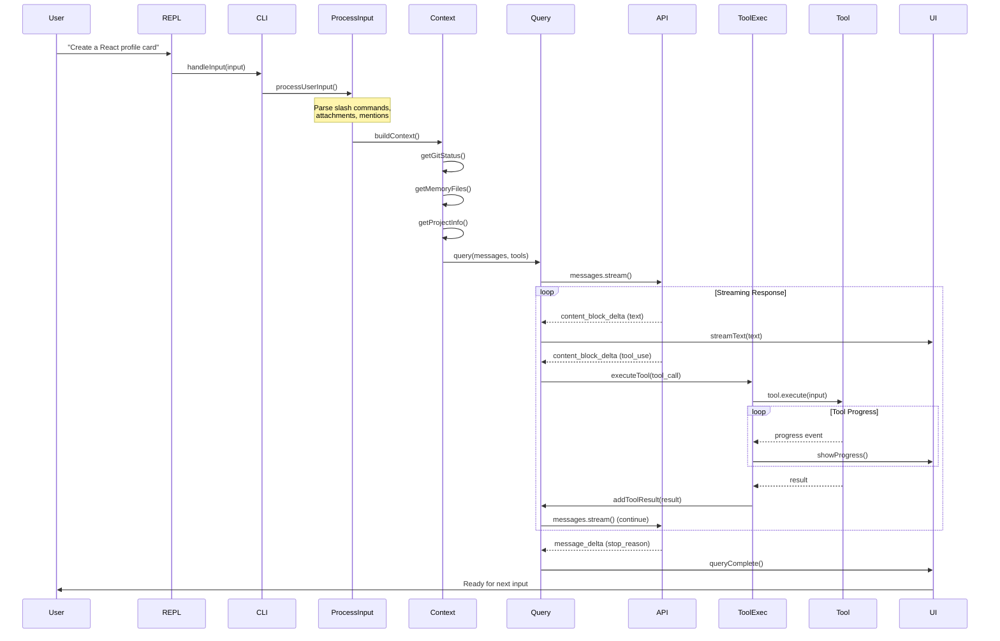

# Request-to-Response Flow: A Complete Trace

This document traces a single user request through Claude Code from input to output, showing exactly what happens at each step.

## The Scenario

**User Input**: "Create a React component for a user profile card"

## Step-by-Step Flow

### Step 1: CLI Input (main.tsx)

When the user types and presses Enter, the input is captured by the REPL:

```typescript
// ink/components/TextInput.tsx
const TextInput = ({ onSubmit }) => {
  const handleKeyDown = (key) => {
    if (key === 'Enter') {
      onSubmit(inputValue)
    }
  }
  // ...
}
```

The REPL passes the input to the command handler:

```typescript
// cli/handlers/input.ts
export async function handleInput(input: string): Promise<void> {
  // Check for slash commands first
  if (input.startsWith('/')) {
    const { command, args } = parseSlashCommand(input)
    await executeCommand(command, args)
    return
  }
  
  // Regular input goes to processUserInput
  await processUserInput({
    input,
    source: 'repl',
  })
}
```

### Step 2: Process User Input (utils/processUserInput.ts)

The input goes through several transformations:

```typescript
// utils/processUserInput/processUserInput.ts
export async function processUserInput(
  params: ProcessUserInputParams
): Promise<ProcessUserInputResult> {
  // 1. Parse slash commands
  const { command, args } = parseSlashCommand(params.input)
  if (command) {
    return handleSlashCommand(command, args)
  }
  
  // 2. Handle special keywords (e.g., @agent mentions)
  const { input, mentions } = processAgentMentions(params.input)
  
  // 3. Process attachments (images, files)
  const attachments = await getAttachmentMessages(params.attachments)
  
  // 4. Check for hook-blocked prompts
  const hookBlocking = await getUserPromptSubmitHookBlockingMessage()
  if (hookBlocking) {
    return { blocked: true, reason: hookBlocking }
  }
  
  // 5. Create user message
  const userMessage = createUserMessage({
    content: input,
    attachments,
  })
  
  // 6. Return for query engine
  return {
    messages: [userMessage],
    shouldQuery: true,
  }
}
```

### Step 3: Build Context (context.ts)

Before sending to the API, Claude Code builds a rich context:

```typescript
// context.ts
export async function buildQueryContext(
  userMessage: UserMessage
): Promise<QueryContext> {
  // Run all context gatherers in parallel
  const [
    gitStatus,
    projectInfo,
    memoryFiles,
    selection,
  ] = await Promise.all([
    getGitStatus(),           // "git status --short"
    getProjectInfo(),         // Package.json, language, etc.
    getMemoryFiles(),         // .claude/memory.md
    getIDESelection(),        // Currently selected text
  ])
  
  // Build system prompt parts
  const systemParts = [
    '# Git Status\n' + gitStatus,
    '# Project Info\n' + projectInfo,
    memoryFiles ? '# Memory\n' + memoryFiles : null,
  ].filter(Boolean)
  
  return {
    messages: [userMessage],
    systemPrompt: systemParts.join('\n\n'),
  }
}
```

### Step 4: Initialize Query (query.ts)

The query orchestrator sets up the API call:

```typescript
// query.ts
export async function query(params: QueryParams): Promise<void> {
  // 1. Build conversation messages
  const messages = await buildConversationMessages(params)
  
  // 2. Get tools for this context
  const tools = await getTools({
    appState: params.appState,
    mcpServers: params.mcpServers,
  })
  
  // 3. Determine model
  const model = getMainLoopModel(params.modelOverride)
  
  // 4. Create query engine
  const engine = new QueryEngine({
    messages,
    model,
    tools,
    systemPrompt: buildSystemPrompt(params),
  })
  
  // 5. Start streaming
  for await (const event of engine.stream()) {
    yield handleStreamEvent(event)
  }
}
```

### Step 5: API Call (services/api/claude.ts)

The actual API request is constructed and sent:

```typescript
// services/api/claude.ts
async function createStreamingMessage(
  params: MessageParams
): Promise<Stream> {
  // 1. Normalize messages for API
  const normalizedMessages = normalizeMessagesForAPI(params.messages)
  
  // 2. Convert tools to API schema
  const apiTools = params.tools.map(toolToAPISchema)
  
  // 3. Add thinking config if enabled
  const thinkingConfig = shouldEnableThinkingByDefault()
    ? { type: 'enabled', budgetTokens: 10000 }
    : undefined
  
  // 4. Send streaming request
  const stream = await client.messages.stream({
    model: params.model,
    max_tokens: getModelMaxOutputTokens(params.model),
    messages: normalizedMessages,
    tools: apiTools,
    thinking: thinkingConfig,
  })
  
  return stream
}
```

### Step 6: Stream Response (QueryEngine.ts)

The streaming response is processed in real-time:

```typescript
// QueryEngine.ts
async *stream(): AsyncGenerator<StreamEvent> {
  const stream = await createStreamingMessage(this.params)
  
  for await (const event of stream) {
    // Process each event type
    switch (event.type) {
      case 'content_block_start':
        if (event.content_block.type === 'tool_use') {
          yield { type: 'tool_start', tool: event.content_block.name }
        }
        break
        
      case 'content_block_delta':
        if (event.delta.type === 'text_delta') {
          yield { type: 'text', text: event.delta.text }
        } else if (event.delta.type === 'tool_use_delta') {
          yield { type: 'tool_input', chunk: event.delta.input }
        }
        break
        
      case 'content_block_stop':
        if (event.content_block.type === 'tool_use') {
          yield { type: 'tool_complete', tool: event.content_block }
        }
        break
        
      case 'message_delta':
        yield { type: 'usage', usage: event.usage }
        break
    }
  }
}
```

### Step 7: Handle Stream Events

As text arrives, it's displayed. When tool calls are detected, they're executed:

```typescript
// query.ts - event handling
for await (const event of engine.stream()) {
  switch (event.type) {
    case 'text':
      // Stream text to UI
      streamTextToUI(event.text)
      break
      
    case 'tool_start':
      // Start building tool call UI
      showToolStart(event.tool)
      break
      
    case 'tool_input':
      // Append input as it arrives
      appendToolInput(event.chunk)
      break
      
    case 'tool_complete':
      // Execute the tool
      const result = await executeTool(event.tool)
      // Add result to messages for next iteration
      addToolResultToMessages(event.tool, result)
      break
      
    case 'usage':
      // Update token count
      updateTokenUsage(event.usage)
      break
  }
}
```

### Step 8: Tool Execution Pipeline

When a tool call is detected, the orchestration pipeline runs:

```typescript
// services/tools/toolOrchestration.ts
async function* executeToolChain(
  toolCalls: ToolCall[]
): AsyncGenerator<ToolResult> {
  for (const toolCall of toolCalls) {
    // 1. Find tool implementation
    const tool = findToolByName(toolCall.name)
    
    // 2. Check permissions
    const canUse = await canUseTool(toolCall.name)
    if (!canUse) {
      yield { error: 'Permission required', tool: toolCall.name }
      continue
    }
    
    // 3. Execute with progress streaming
    for await (const progress of tool.execute(toolCall.input)) {
      yield { progress }  // UI shows progress
    }
    
    // 4. Return final result
    yield { result: toolCall.result }
  }
}
```

### Step 9: Specific Tool: FileEditTool

For "Create a React component", Claude might call `BashTool` to check if the file exists, then `FileWriteTool` or `FileEditTool`:

```typescript
// tools/FileWriteTool/FileWriteTool.ts
export async function* execute(
  input: FileWriteInput,
  context: ToolUseContext
): AsyncGenerator<Progress> {
  // 1. Check if directory exists
  yield { type: 'checking', path: input.path }
  const dirExists = await pathExists(dirname(input.path))
  
  if (!dirExists) {
    yield { type: 'creating_dir', path: dirname(input.path) }
    await mkdir(dirname(input.path), { recursive: true })
  }
  
  // 2. Write file
  yield { type: 'writing', path: input.path }
  await writeFile(input.path, input.content)
  
  // 3. Report success
  yield { type: 'complete', path: input.path }
}
```

### Step 10: Continue Query Loop

After tool execution, the result is added to messages and the loop continues:

```typescript
// query.ts - continuation loop
async function* completeQuery(params): AsyncGenerator<Event> {
  // ... initial API call ...
  
  // After tool execution
  while (true) {
    // Add tool result to messages
    params.messages.push(createToolResultMessage(result))
    
    // Check if we should continue
    if (shouldContinue(params.messages)) {
      // Make another API call with updated messages
      const stream = await createStreamingMessage(params)
      for await (const event of stream) {
        yield event
      }
    } else {
      break
    }
  }
}
```

### Step 11: Final Response

Once the AI is done (no more tool calls, stop_reason = 'end_turn'):

```typescript
// QueryEngine.ts - final event
case 'message_stop':
  yield {
    type: 'complete',
    stopReason: event.stop_reason,
    usage: finalUsage,
    cost: calculateCost(finalUsage),
  }
  break
```

### Step 12: UI Finalization

The UI wraps up:

```typescript
// Terminal UI
const handleQueryComplete = (result: QueryResult) => {
  // 1. Stop the spinner
  stopSpinner()
  
  // 2. Show final message
  addMessage(result.finalMessage)
  
  // 3. Show token usage
  showTokenUsage(result.usage)
  
  // 4. Check for context compaction
  if (shouldCompact(result.totalTokens)) {
    triggerCompaction()
  }
  
  // 5. Ready for next input
  setMode('waiting_for_input')
}
```

## Complete Sequence Diagram



## Timing Overview

| Step | Typical Duration | Notes |
|------|------------------|-------|
| CLI Input Capture | <1ms | Event listener |
| Slash Command Parse | 1-5ms | String parsing |
| Attachment Processing | 10-500ms | Depends on file sizes |
| Context Building | 50-500ms | Git commands, file reads |
| API Call Setup | 10-50ms | Message normalization |
| First Token (API) | 200-2000ms | Depends on model/server |
| Token Streaming | 20-100ms/token | Depends on response length |
| Tool Execution | 10ms-60s | Depends on tool complexity |
| File Write | 5-50ms | Depends on file size |

## What Could Go Wrong (Error Handling)

### API Errors

```typescript
// Retry with backoff
async function queryWithRetry(params, maxRetries = 3) {
  for (let i = 0; i < maxRetries; i++) {
    try {
      return await query(params)
    } catch (error) {
      if (isRetryableError(error)) {
        const delay = Math.pow(2, i) * 1000
        await sleep(delay)
        continue
      }
      throw error
    }
  }
}
```

### Permission Denied

```typescript
// User denies permission
if (error instanceof PermissionDeniedError) {
  // Report to user
  showError("Permission denied for " + error.tool)
  // Add denial to tracking
  trackDeniedPermission(error.tool)
  // Don't retry - move on
  return
}
```

### Tool Execution Error

```typescript
// Tool fails
try {
  await tool.execute(input)
} catch (error) {
  // Report error to AI
  yield createErrorMessage(error.message)
  // AI will decide to retry or work around
}
```

## Summary

The request-to-response flow demonstrates:

1. **Layered Architecture** — Each layer has one job
2. **Streaming Throughout** — Nothing blocks, everything streams
3. **Async Generators** — Perfect for streaming + tool loops
4. **Permission Gates** — Safety at every step
5. **Context Enrichment** — System prompt built from real project data
6. **Error Recovery** — Graceful handling at every level
