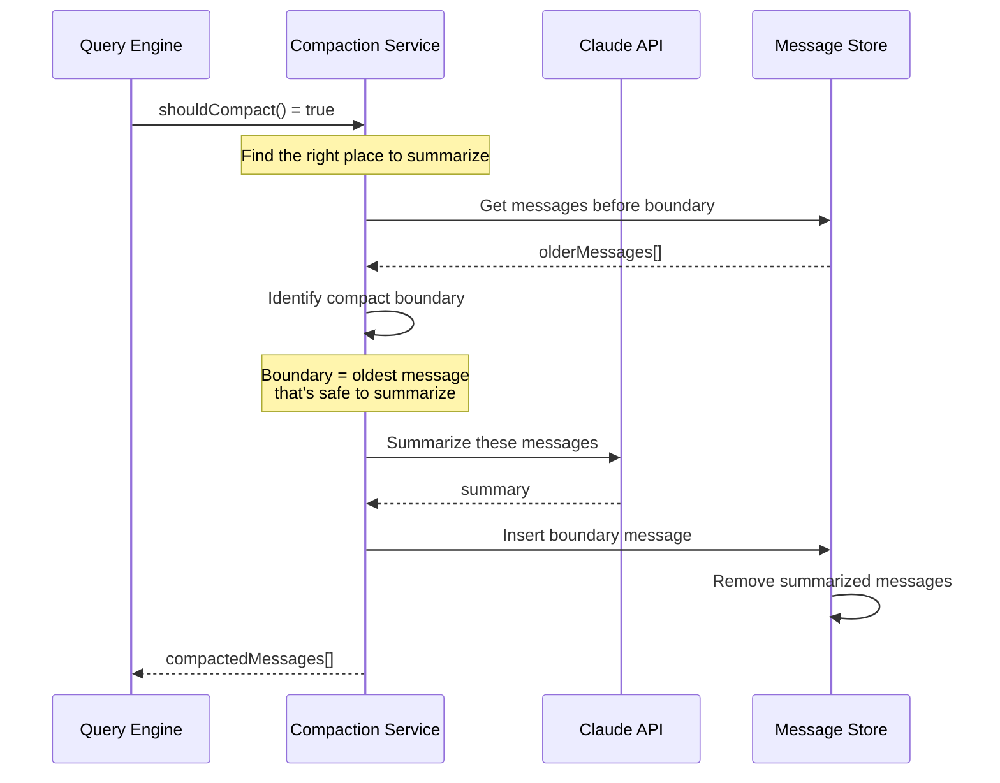

# Memory System: How Claude Code Remembers

Claude Code has a sophisticated multi-layered memory system that spans from ephemeral per-conversation state to persistent cross-session knowledge. This document explains how memory works at every level.

## Memory Architecture

```
┌─────────────────────────────────────────────────────────────┐
│                    MEMORY LAYERS                           │
├─────────────────────────────────────────────────────────────┤
│  ┌─────────────────────────────────────────────────────┐   │
│  │         SESSION MEMORY (Conversation)               │   │
│  │  Messages, tool results, current context            │   │
│  │  Lives: Current session only                       │   │
│  │  Size: Up to context window limit                  │   │
│  └─────────────────────────────────────────────────────┘   │
│                         │                                  │
│  ┌─────────────────────────────────────────────────────┐   │
│  │         COMPACTED MEMORY (Summarization)           │   │
│  │  Summarized older messages, key decisions           │   │
│  │  Lives: Until next compaction                       │   │
│  │  Size: Much smaller than original                  │   │
│  └─────────────────────────────────────────────────────┘   │
│                         │                                  │
│  ┌─────────────────────────────────────────────────────┐   │
│  │         PERSISTENT MEMORY (.claude/)               │   │
│  │  Memory files, patterns, preferences               │   │
│  │  Lives: Across sessions                             │   │
│  │  Location: Project/.claude/ directory              │   │
│  └─────────────────────────────────────────────────────┘   │
│                         │                                  │
│  ┌─────────────────────────────────────────────────────┐   │
│  │         LEARNED PATTERNS (Implicit)                │   │
│  │  Inferred preferences, coding style                │   │
│  │  Lives: Session (with user guidance)              │   │
│  └─────────────────────────────────────────────────────┘   │
└─────────────────────────────────────────────────────────────┘
```

## Session Memory (Conversation State)

### Message Storage

```typescript
// state/AppState.tsx
interface AppState {
  messages: Message[]
  // Messages accumulate throughout the session
}

// Message types
type Message =
  | UserMessage          // User input
  | AssistantMessage     // AI responses
  | ToolResultMessage    // Tool outputs
  | SystemMessage        // System info
  | ProgressMessage      // Streaming progress
```

### Context Building

```typescript
// context.ts - builds context from session state
export async function buildQueryContext(
  params: QueryParams
): Promise<QueryContext> {
  // 1. Get current messages
  const messages = params.appState.messages
  
  // 2. Add recent context (last N messages)
  const recentMessages = messages.slice(-20)
  
  // 3. Add tool results
  const toolResults = await getRecentToolResults(messages)
  
  // 4. Build context string
  return {
    messages: [...recentMessages, ...toolResults],
    systemPrompt: buildSystemPrompt(),
  }
}
```

## Context Compaction (services/compact/)

### When Compaction Happens

```typescript
// Trigger compaction at these thresholds:
// 1. Token usage > 85% of context limit
// 2. Message count > 100 messages
// 3. User manually triggers /compact

function shouldCompact(
  messages: Message[],
  usage: Usage
): boolean {
  const contextLimit = getContextLimit()
  const usageRatio = usage.total_tokens / contextLimit
  
  return usageRatio > 0.85 || messages.length > 100
}
```

### Compaction Process



### Compact Boundary Detection

```typescript
// Finding where to "cut" for summarization
function findCompactBoundary(
  messages: Message[]
): number {
  // Never compact:
  // - Most recent messages (still relevant)
  // - Tool results (still need for tool use)
  // - The current task context
  
  // Look for natural break points:
  // - After a completed task
  // - Before a new topic
  // - After N messages
  
  // Find the oldest message that's "safe" to summarize
  for (let i = messages.length - 1; i >= 0; i--) {
    if (isSafeToCompact(messages[i])) {
      return i
    }
  }
  
  // Fallback: compact older half
  return Math.floor(messages.length / 2)
}

function isSafeToCompact(message: Message): boolean {
  // Don't compact if:
  if (message.type === 'tool_result') return false
  if (message.type === 'user' && isRecent(message)) return false
  
  // Safe to compact if:
  // - It's old assistant response
  // - It's system context
  return true
}
```

### Summarization Prompt

```typescript
// Prompt sent to Claude to summarize
const SUMMARIZE_PROMPT = `
Please summarize the following conversation, keeping:
1. Key decisions made
2. Important code changes
3. Files modified
4. Problems solved
5. Any patterns or preferences established

Conversation to summarize:
${olderMessages.join('\n\n')}

Provide a concise summary (under 500 words) that captures
the essential information needed to continue working on
this project.
`.trim()
```

## Persistent Memory (.claude/)

### Memory Directory Structure

```
project/
├── .claude/
│   ├── memory.md              # Main memory file
│   ├── patterns/              # Learned patterns
│   │   ├── coding-style.md
│   │   └── architecture.md
│   ├── preferences/          # User preferences
│   │   ├── editor.md
│   │   └── workflow.md
│   └── context/             # Project context
│       ├── tech-stack.md
│       └── design-decisions.md
```

### Memory Files

```typescript
// utils/claudemd.ts - Memory file handling

// Load all memory files
export async function getMemoryFiles(): Promise<MemoryFile[]> {
  const memdir = getMemoryDir()
  
  const files = [
    'memory.md',
    'patterns/coding-style.md',
    'preferences/editor.md',
  ]
  
  const memories = await Promise.all(
    files.map(async (file) => {
      const path = join(memdir, file)
      if (await pathExists(path)) {
        return {
          name: file,
          content: await readFile(path),
        }
      }
      return null
    })
  )
  
  return memories.filter(Boolean)
}

// Add to memory
export async function addToMemory(
  content: string,
  type: 'pattern' | 'preference' | 'context'
): Promise<void> {
  const memdir = getMemoryDir()
  const file = join(memdir, `${type}s/${generateFilename(content)}.md`)
  
  await writeFile(file, content)
}
```

### Memory Loading

```typescript
// context.ts - Memory is injected into system prompt
export async function buildSystemPrompt(): Promise<string> {
  const [projectContext, memoryFiles] = await Promise.all([
    getProjectContext(),
    getMemoryFiles(),
  ])
  
  const memorySection = memoryFiles.length > 0
    ? '# Memory\n' + memoryFiles.map(f => f.content).join('\n\n')
    : ''
  
  return [
    BASE_SYSTEM_PROMPT,
    projectContext,
    memorySection,
  ].filter(Boolean).join('\n\n')
}
```

### Memory Updating

```typescript
// After each task completion, consider updating memory
async function considerMemoryUpdate(
  task: CompletedTask,
  context: Context
): Promise<void> {
  // Check if we learned anything worth remembering
  
  if (task.patterns.length > 0) {
    await addToMemory(
      `Learned: ${task.patterns.join(', ')}`,
      'pattern'
    )
  }
  
  if (task.preferences.length > 0) {
    await addToMemory(
      `User prefers: ${task.preferences.join(', ')}`,
      'preference'
    )
  }
}
```

## Implicit Memory (Session-Level Learning)

### Tracking Patterns

```typescript
// The model tracks patterns during the session
interface SessionPatterns {
  codingStyle: 'functional' | 'oop' | 'mixed'
  testingApproach: 'TDD' | 'after' | 'minimal'
  communicationStyle: 'detailed' | 'concise'
  gitStrategy: 'commit-often' | 'batched'
  
  // Inferred from:
  // - How user responds to suggestions
  // - Which tools they prefer
  // - Their editing patterns
}

// Update patterns based on interactions
function updatePatterns(
  current: SessionPatterns,
  interaction: Interaction
): SessionPatterns {
  // If user always approves minimal changes...
  if (interaction.userApprovedMinimalChanges) {
    return {
      ...current,
      preferredChangeSize: 'minimal',
    }
  }
  
  return current
}
```

### Context Injection from Patterns

```typescript
// Patterns are used to guide future interactions
export function applyPatternsToPrompt(
  prompt: string,
  patterns: SessionPatterns
): string {
  const patternGuidance = []
  
  if (patterns.preferredChangeSize === 'minimal') {
    patternGuidance.push(
      'User prefers minimal, focused changes.'
    )
  }
  
  if (patterns.communicationStyle === 'concise') {
    patternGuidance.push(
      'User prefers concise responses.'
    )
  }
  
  return patternGuidance.length > 0
    ? prompt + '\n\n# Session Patterns\n' + patternGuidance.join('\n')
    : prompt
}
```

## Memory Management Commands

### /memory Command

```typescript
// commands/memory.ts
const MEMORY_COMMANDS = {
  '/memory show': 'Display current memory contents',
  '/memory add': 'Add new memory',
  '/memory update': 'Update existing memory',
  '/memory delete': 'Remove memory',
  '/memory clear': 'Clear all memory',
}

// Implementation
async function handleMemoryCommand(
  args: string[]
): Promise<void> {
  const subcommand = args[0]
  
  switch (subcommand) {
    case 'show':
      await showMemory()
      break
    case 'add':
      await addMemory(args.slice(1).join(' '))
      break
    case 'update':
      await updateMemory(args.slice(1))
      break
  }
}
```

## Memory Synchronization

### Across Multiple Sessions (Team Feature)

```typescript
// services/teamMemorySync/ - Team memory synchronization
// When using Claude Code in team mode, memory is shared

interface TeamMemory {
  sharedPatterns: Pattern[]
  projectContext: Context
  decisions: Decision[]
}

// Sync memory to team
async function syncTeamMemory(
  localMemory: Memory
): Promise<void> {
  const teamId = getCurrentTeamId()
  
  await api.team.updateMemory(teamId, {
    patterns: localMemory.patterns,
    context: localMemory.context,
  })
}

// Fetch team memory
async function fetchTeamMemory(): Promise<TeamMemory> {
  const teamId = getCurrentTeamId()
  
  return await api.team.getMemory(teamId)
}
```

## Memory Optimization

### What to Remember vs. Forget

```typescript
// Memory retention policy
const RETENTION_POLICY = {
  // Always remember:
  critical: [
    'Security patterns',
    'User preferences',
    'Architecture decisions',
    'API patterns',
  ],
  
  // Remember temporarily:
  session: [
    'Current task progress',
    'Recent file edits',
    'Error messages seen',
  ],
  
  // Forget when old:
  forget: [
    'Debug output',
    'Failed attempts',
    'Intermediate states',
  ],
}
```

### Memory Efficiency

```typescript
// Keep memory lean
export function optimizeMemory(memory: Memory): Memory {
  return {
    ...memory,
    
    // Remove redundant information
    patterns: deduplicatePatterns(memory.patterns),
    
    // Prune old patterns
    patterns: pruneOldPatterns(memory.patterns),
    
    // Merge similar patterns
    patterns: mergeSimilarPatterns(memory.patterns),
    
    // Compress long content
    longContent: compressContent(memory.longContent),
  }
}
```

## Summary

Claude Code's memory system has multiple layers:

1. **Session Memory** — Full conversation until compaction
2. **Compacted Memory** — Summarized older conversations
3. **Persistent Memory** — `.claude/` files across sessions
4. **Implicit Memory** — Patterns inferred during session

The system is designed to:
- Remember important context without hitting limits
- Learn from user preferences over time
- Share knowledge in team environments
- Keep memory efficient and relevant
